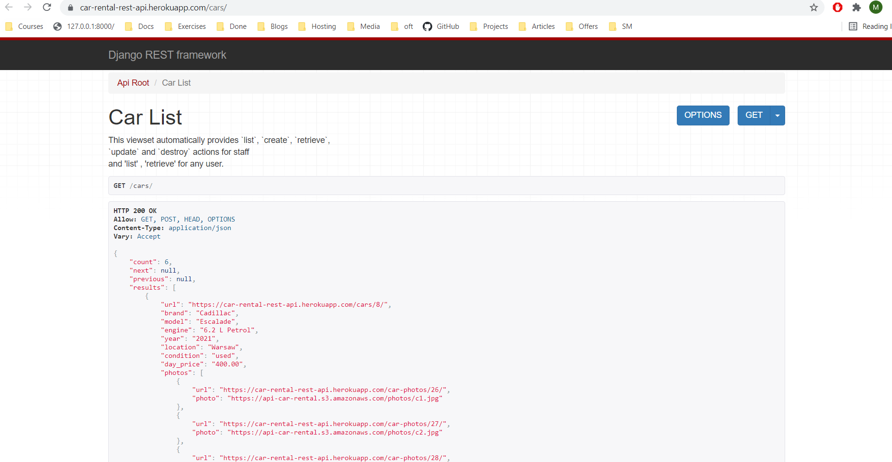
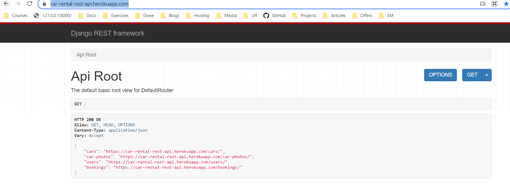
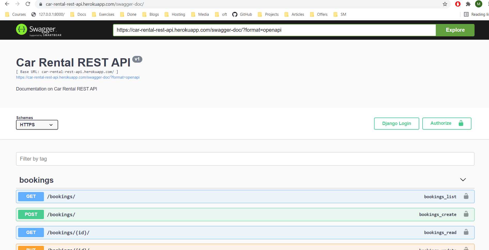
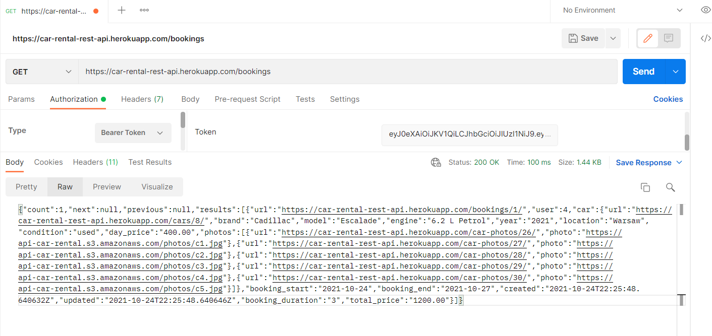

# CarRental REST API

## Table of contents
* [General info](#general-info)
* [Technologies](#technologies)
* [Features](#features)
* [To do](#to-do)
* [Documentation](#documentation)
* [Setup](#setup)

## General info

Simple REST API created with Django Rest Framework. Car booking app created for learning purpose.
API uses JWT authentication but session auth is turned on too for easy browsing. You can log in with credentials: `Client01:CliPass01` or `Worker01:WorPass01`.

## Technologies
 - Python
 - Django
 - Django Rest Framework
 - Postgreql
 - Unittest or pytest (in future)
 - Heroku

## Features

 - User CRUD actions for user and staff
 - Car CRUD actions for staff
 - Car photos CRUD actions for staff
 - Booking CRUD actions for users and staff
 - custom permissions
 - JWT authentication
 - logout and logout on all devices
 - change and reseting password
 - sending activation email
 - soft delete of user
 - filering and ordering of bookings
 - pagination
 - swagger-documentation
 - create and update actions for nested viewsets
 - custom validations in serializers
 - booking overlapping prevention
 - CORS headers

## To do

 - Tests

 ## Documentation

 API root : https://car-rental-rest-api.herokuapp.com/

 all endpoints and documentation available at:

 swagger : https://car-rental-rest-api.herokuapp.com/swagger-doc

 redoc: https://car-rental-rest-api.herokuapp.com/redoc

 ## Setup 

Clone repo `git clone https://github.com/MateuszM-M/CarRental`,

Go to repo directory `cd CarRental`,

Create virtual environment `python -m venv venv`,

Activate environment `venv\scripts\activate`,

Install required packages `pip install -r requirements.txt`,

Rename MMblog/settings/`.env-example` to `.env`,

Migrate database `python manage.py migrate`,

Create superuser `python manage.py createsuperuser`,

Make server up and running `python manage.py runserver`,

Browse http://127.0.0.1:8000/

Or

Online demo: https://car-rental-rest-api.herokuapp.com/

You can log in with credentials: `Client01:CliPass01` or `Worker01:WorPass01`. Reset and change password endpoints are commented out but you can still use and check them on local machine.

